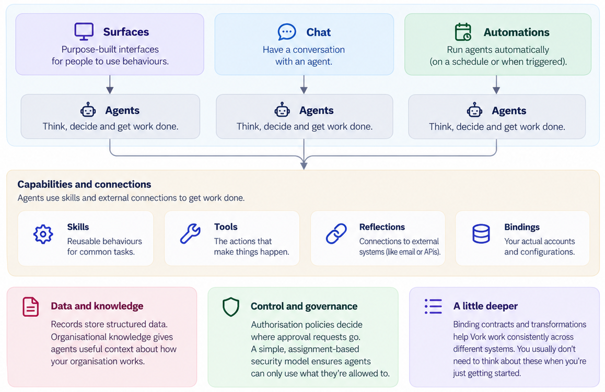

# Understanding Vork

You have Vork running and you're signed in. Now what?

Vork is built around **behaviours**: useful things you want to happen.

You might want to monitor conversations about your product, investigate a support issue, triage an inbox, prepare a newsletter, or automate something you do every day.

Vork gives you the building blocks to make those behaviours happen.

You don't need to understand every part of Vork before you start. This page gives you the big picture so you can explore and understand what you're looking at.

## Three Ways to Use Vork

There are three main ways to make things happen in Vork:

### Surfaces

Surfaces are purpose-built user interfaces for behaviours.

Instead of having a conversation with AI, a Surface can present forms, tables, buttons and other familiar controls. Surfaces can use Vork's capabilities directly or work with an Agent when reasoning or conversation is needed.

### Chat

Chat lets you work with an Agent through conversation.

Tell an Agent what you want to achieve. It can gather information, use Skills and Tools, ask you questions and work with other people when needed.

### Automations

Automations let Agents work without you having to start the conversation.

They can run on a schedule, as a one-off task, or manually. If an Agent needs information or approval from someone, the work can pause and wait for them.

*The main components of Vork and how they fit together.*

These aren't three separate systems. They use the same building blocks underneath.

A behaviour you first explore through Chat might later run automatically or become part of a purpose-built Surface.

## Agents

Agents do the thinking.

They can inspect information, make decisions, use capabilities, ask questions and coordinate work.

An Agent can be general purpose or created for a particular job.

### Concierge

Concierge is your general-purpose Agent and a good place to start exploring Vork.

You can ask Concierge to investigate something, try an idea or help you understand what Vork can do.

As behaviours become more specialised, you can create dedicated Agents for them.

## Skills

Skills are reusable behaviours for getting a particular kind of work done.

An Agent might use a Skill to summarise an email, investigate a support issue, prepare a newsletter or scan Reddit for relevant conversations.

Skills can use Tools and other Skills to complete their work.

They also help contain complexity. A Skill can work with a large amount of information and return only what the calling Agent needs.

## Tools

Tools are actions that make things happen.

They might search for emails, read a record, write a file, send a notification or perform an operation in another system.

Agents don't automatically have access to every Tool in Vork. They can only use the capabilities assigned to them.

## Reflections

Reflections give Vork access to external systems.

For example, an email Reflection might provide ways to search, read and send email. Another Reflection might provide access to a CRM, file store or external API.

Reflections give Vork a consistent way to work with systems outside Vork.

## Bindings

A Binding connects a Reflection to a real account or system.

For example, the same email Reflection could have separate Bindings for your personal mailbox, support mailbox and accounts mailbox.

This lets behaviours work with the capability they need without being tied to one particular account.

## Records

Records are structured information stored inside Vork.

Behaviours can create, find and update Records when they need information that should survive beyond a conversation.

Records might represent customers, categories, configuration, processing history or any other structured information your behaviours need.

## Organisational Knowledge

Not everything about how your organisation works belongs in a database or configuration screen.

Organisational Knowledge lets Vork learn useful context about how you work.

You might tell Vork:

> Lee handles accounts.

or:

> Bob deals with technical support.

That knowledge can then help Agents make better decisions.

If something changes, you can simply teach Vork the new information.

## Sessions

Sessions represent ongoing conversations and units of work.

A Session can involve you, an Agent, other Vork users and even people outside Vork.

This allows work to continue over time instead of every interaction starting again from scratch.

## External and Outgoing Messages

People outside Vork can participate in Sessions too.

An incoming email, for example, can become an **External** message in a Session. If Vork later sends an approved reply, the exact message sent can be recorded as **Outgoing**.

The communication channel doesn't have to be email. The same model can support other channels such as Slack, WhatsApp or Telegram.

This means Vork can treat the whole exchange as one conversation regardless of how each participant communicates.

## Jobs

Jobs are how automated Agent work is currently run in Vork.

A Job can run on a schedule, once, or manually.

The Agent running the Job uses the same Skills, Tools, Reflections and Bindings it could use during an interactive conversation.

If human input or approval is required, the work can pause until it receives it.

## Security and Authorisation

Access in Vork is based on assignment.

Agents can only use the Skills, Tools and Bindings assigned to them. Skills can only use the Tools or other Skills assigned to them.

If something isn't assigned, it can't be used.

Authorisation policies add human approval where it is needed. They determine who should be asked before protected actions are allowed to continue.

## A Little Deeper

As you explore Vork you'll encounter a few more concepts.

### Binding Contracts

Binding Contracts provide a common way to use similar capabilities from different systems.

For example, a Skill can work with an email contract without needing to know which particular email provider is behind it.

### Transformations

Transformations reshape data as it moves between capabilities.

They are deterministic, so simple data conversion doesn't need to be performed by AI.

You don't need to understand either of these concepts to start exploring Vork. They become useful when you begin building more sophisticated behaviours.

## How It Fits Together

The important thing isn't memorising all of these components.

Start with the behaviour.

If you want Vork to monitor Reddit for conversations about your product, that's the starting point.

The Agent needs to know what you're looking for. It needs a Skill that describes how to find useful conversations. That Skill needs access to the appropriate capabilities. You might run it through Chat while you're experimenting and later turn it into an Automation that runs every morning.

Or perhaps you want to triage an inbox.

An Agent can inspect messages, learn the categories that matter to your organisation, ask questions when it isn't sure, and eventually run that behaviour automatically.

The components exist to support the behaviour, not the other way around.

## Where Do I Start?

Start with something you want to happen.

It doesn't have to be complicated. Think of something you repeatedly do that involves gathering information, making a decision, producing something, or asking somebody a question.

Try it with Concierge.

Once the behaviour starts to become useful, you can explore the Agents, Skills, Reflections and other components that turn it into something repeatable.

You don't need to understand all of Vork before you begin.

**Just Vork.**